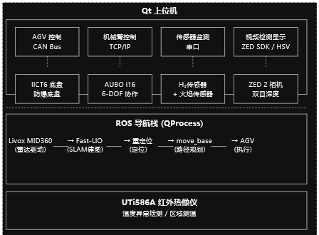

# Inspection_robot_H2

> 加氢站燃爆智能巡检机器人 · Hydrogen Station Explosion Intelligent Inspection Robot

[](LICENSE)
[]()
[]()
[]()
[]()

---

## 项目简介

**Inspection_robot_H2** 是一款专为加氢站（氢燃料加注站）防爆场景打造的自主巡检机器人系统。机器人搭载 Livox MID360 激光雷达，基于 **Fast-LIO** 算法实现全域 3D SLAM 建图与自主导航；融合 **ZED 2 双目相机**、**UTi586A 红外热像仪**、**氢气浓度传感器**和**紫外火焰探测器**等多模态传感器，可对场站内设备高温异常、明火隐患、氢气泄漏等燃爆风险进行全方位检测与预警。上位机基于 **Qt 5 + C++17** 开发，将 AGV 底盘控制、AUBO 机械臂操控、传感器数据采集、实时视频目标检测、ROS 导航栈管理统一集成到一个图形化界面中。

系统已在实际加氢站场景完成多轮实验验证，包括氢气泄漏检测、红外测温、紫外火焰响应、全局地图构建与自主导航等关键功能测试。

---

## 系统架构



---

## 核心功能

### 1. 自主导航与 SLAM

- 基于 Livox MID360 激光雷达 + Fast-LIO 算法，实现**实时 3D 点云建图**与**6-DOF 位姿估计**
- 采用迭代误差状态扩展卡尔曼滤波（ES-EKF）融合 IMU 与 LiDAR 数据
- ikd-Tree 增量式地图管理，支持动态插入、删除与最近邻搜索
- 基于 FOV 的局部地图分割，高效管理大规模场景
- move_base 全局路径规划 + DWA 局部避障，支持 50+ 预定义巡检点位

### 2. 机械臂检测

- 集成 **AUBO-i16** 6 自由度协作机械臂，TCP/IP 通信
- 支持关节空间运动（J1~J6 正反转）与笛卡尔空间运动（XYZ + RPY）
- 可预设检测动作序列，到达巡检点后自动执行
- 速度/加速度可调，支持平滑启停

### 3. 多模态传感检测

| 传感器 | 检测对象 | 通信协议 | 采样方式 |
|--------|----------|----------|----------|
| 氢气传感器 | H₂ 浓度 | RS485 / Modbus RTU | 1Hz 轮询 |
| 紫外火焰传感器 | 明火/火花 | RS485 串口 | 1Hz 轮询 |
| ZED 2 双目相机 | 仪表/液位/指示灯 | USB 3.0 | 实时视频流 |
| UTi586A 红外热像仪 | 设备温度异常 | Ethernet | 按需采集 |

### 4. 视觉目标检测

- 基于 HSV 色彩空间的实时目标检测
- 高光抑制 + 形态学处理（开/闭运算）
- 连通域分析，支持面积/宽高/矩形度多维度滤波
- 实时参数调节滑块，便于现场调试
- 支持检测结果保存（图像 + CSV 坐标）

### 5. 巡检任务编排

- 按区域（B/C/D/E）组织巡检点位
- 支持手动逐点巡检与自动序列巡检两种模式
- AGV 自动导航到位 → 机械臂执行检测动作 → 传感器记录数据
- 实时显示机器人位姿、传感器趋势图、导航状态

---

## 硬件平台

| 序号 | 组件 | 型号 | 通信接口 | 说明 |
|------|------|------|----------|------|
| 1 | 防爆底盘 | IICT6 | CAN Bus (USB-CAN) | 标准 CAN 2.0 帧 |
| 2 | 协作机械臂 | AUBO-i16 | TCP/IP :8899 | 负载 16kg |
| 3 | 激光雷达 | Livox MID360 | Ethernet | 360° FOV |
| 4 | 双目相机 | Stereolabs ZED 2 | USB 3.0 | 1080p 深度 |
| 5 | 红外热像仪 | UTi586A | Ethernet | -20~650°C |
| 6 | 氢气传感器 | — | RS485 | Modbus RTU |
| 7 | 火焰传感器 | 紫外 | RS485 | 185~260nm |
| 8 | 工控机 | — | — | Ubuntu 20.04 |

---

## 软件架构

### 技术栈

```
┌─────────────────────────────────┐
│          应用层 (Qt 5)           │
│  mainwindow.cpp  (~4100 行)      │
├─────────────────────────────────┤
│   AGV    │ 机械臂  │ 传感器 │ 相机│
│  zcan.h  │ aubo_  │ sensor │ ZED│
│  agv.cpp │ robot  │ monitor│ SDK│
├──────────┴────────┴────────┴────┤
│        ROS Noetic 中间件         │
│  roscpp / tf2 / actionlib       │
├─────────────────────────────────┤
│        Linux (Ubuntu 20.04)      │
└─────────────────────────────────┘
```

### 关键设计

- **单窗口核心**：`mainwindow.cpp` 作为集成枢纽，管理所有子系统生命周期
- **定时器驱动**：AGV 序列、传感器轮询、视频帧处理、ROS 状态更新均通过 QTimer 调度
- **多线程**：传感数据采集（DataThread）+ 视频处理（VideoProcessingThread）独立于 UI 线程
- **进程管理**：6 个 ROS 节点通过 QProcess 管理，标准化启停控制与日志输出
- **信号槽解耦**：线程间通过 Qt 信号槽传递数据，UI 与逻辑分离

---

## 算法概览

### Fast-LIO（激光 SLAM）
- **文件**: `algorithms/laserMapping.cpp`（1001 行）
- **方法**: 迭代误差状态扩展卡尔曼滤波（ES-EKF）
- **数据结构**: ikd-Tree 增量式 KD 树
- **配准**: 点到平面 ICP
- **状态维度**: 21 维（位姿 + 速度 + 偏置 + 重力）

### IMU 预处理
- **文件**: `algorithms/IMU_Processing.hpp`（377 行）
- **功能**: IMU 初始化、前向传播、点云运动畸变补偿（反向传播）

### 多点导航
- **文件**: `algorithms/nav_point.cpp`（127 行）
- **功能**: 基于 RViz 点击 + move_base actionlib 的队列式多目标导航

### HSV 视觉检测
- **文件**: `algorithms/shipinliu.cpp`（193 行）
- **功能**: 高斯模糊 → HSV 阈值 → 高光去除 → 形态学 → 连通域分析 → 几何过滤

---

## 目录结构

```
Inspection_robot_H2/
├── src/                           # 上位机控制程序 (Qt/C++)
│   ├── AGV_test.pro               # Qt 项目文件
│   ├── main.cpp                   # 程序入口
│   ├── mainwindow.cpp             # 主窗口 (~4100行，核心集成)
│   ├── mainwindow.h               # 主窗口头文件
│   ├── mainwindow.ui              # UI 布局文件
│   ├── agv.cpp / agv.h           # AGV 底盘 CAN 总线控制
│   ├── aubo_robot.cpp / aubo_robot.h  # AUBO 机械臂控制
│   ├── sensormonitor.cpp / .h    # 传感器数据采集与显示
│   ├── opencamera.cpp             # ZED 相机初始化和帧采集
│   ├── shipinliu.cpp              # 视频流处理与 HSV 目标检测
│   ├── enter_save.cpp             # 图像保存工具
│   ├── LED.cpp / LED.h           # LED 指示灯自定义控件
│   ├── particleprogress.cpp / .h # 粒子特效进度条控件
│   ├── DataThread.h               # 传感器数据采集线程
│   ├── zcan.h                     # CAN 协议帧定义
│   ├── util.h                     # 工具宏与辅助函数
│   ├── demo_simple_goal.cpp       # 独立巡检导航 ROS 节点
│   └── include/
│       └── Camera.hpp             # Stereolabs ZED SDK C++ 封装
├── algorithms/                    # 核心算法
│   ├── laserMapping.cpp           # Fast-LIO LiDAR SLAM
│   ├── IMU_Processing.hpp         # IMU 前向传播 + 点云去畸变
│   ├── nav_point.cpp              # 队列式多点导航
│   └── shipinliu.cpp              # HSV 色彩空间视觉检测
├── docs/                          # 文档
│   ├── architecture.md            # 系统架构详解
│   ├── hardware.md                # 硬件清单与接线说明
│   ├── deployment.md              # 部署指南（从零到运行）
│   └── images/                    # 上位机界面截图
├── assets/
│   └── robot.jpg                  # 机器人实物照片
├── .gitignore
├── LICENSE                        # MIT
└── README.md
```

---

## 快速开始

### 环境要求

- **OS**: Ubuntu 20.04 LTS (x86_64)
- **ROS**: Noetic (desktop-full)
- **Qt**: 5.12+
- **OpenCV**: 4.x
- **CUDA**: 11.x（可选，ZED SDK 加速用）

### 1. 安装系统依赖

```bash
sudo apt update
sudo apt install build-essential cmake git qt5-default qtcreator
sudo apt install libopencv-dev
sudo apt install ros-noetic-roscpp ros-noetic-geometry-msgs \
  ros-noetic-tf2 ros-noetic-tf2-ros ros-noetic-actionlib \
  ros-noetic-move-base-msgs ros-noetic-nav-msgs
```

### 2. 安装 ZED SDK

从 [Stereolabs 官网](https://www.stereolabs.com/developers/release/) 下载对应 Ubuntu 20.04 的 ZED SDK，按官方文档安装后验证：

```bash
/usr/local/zed/tools/ZED_Diagnostic
```

### 3. 安装 AUBO Robot SDK

联系遨博（AUBO）机器人官方获取 Linux C++ SDK，将 SDK 的 `inc/` 和 `lib/` 分别放入：

```
src/dependents/robotSDK/inc/
src/dependents/robotSDK/lib/linux_x64/
src/dependents/log4cplus/linux_x64/lib/
```

### 4. 安装 USB-CAN 驱动

将 `libusbcanfd.so` 放入 `src/lib/`，或通过 apt 安装 `libusb-1.0-0-dev`。

### 5. 搭建 ROS 工作空间

```bash
mkdir -p ~/ws_sentry/src
cd ~/ws_sentry/src
# 放入以下 ROS 包：
#   livox_ros_driver2      — Livox MID360 雷达驱动
#   fast_lio_localization  — Fast-LIO 定位与建图
#   sentry_nav             — move_base 导航配置
#   agv_navigation         — AGV 巡检任务节点
cd ~/ws_sentry && catkin_make
echo "source ~/ws_sentry/devel/setup.bash" >> ~/.bashrc
```

### 6. 编译上位机

```bash
cd src
qmake AGV_test.pro
make -j$(nproc)
```

### 7. 运行

```bash
export ROS_WORKSPACE=~/ws_sentry
./AGV_test
```

### 8. 操作流程

1. 启动雷达驱动 → 等待激光雷达就绪
2. 启动 Fast-LIO 定位 → 等待初始化完成
3. 发布初始位姿 → 在 RViz 中确认
4. 启动 move_base → 启动路径规划
5. 启动 AGV → 开始执行巡检任务
6. 登录机械臂 → 上电 → 巡检点开始检测

详细说明请参阅 [部署指南](docs/deployment.md)。

---

## 界面预览

| 主界面 | 上位机界面 |
|:---:|:---:|
| 待补充 |  |

| 上位机界面1 |
|:---:|:---:|
|  |  |

---

## 实验验证

本项目已在以下场景完成实验验证：

- **广州能源研究所**（2025年8月）：氢气泄漏检测、紫外火焰响应测试、红外测温实验
- **黄埔实验室**（2025年12月）：全局 3D 地图构建（513MB PCD 点云）、自主导航巡检、多传感器融合验证
- **导航专项测试**（2025年9月）：多点连续导航、全局路径规划稳定性测试

---

## 引用

若本项目对您的研究有帮助，欢迎引用：

```bibtex
@software{Inspection_robot_H2,
  author       = {ZNzn825},
  title        = {Inspection\_robot\_H2: Hydrogen Station Intelligent Inspection Robot},
  year         = {2025},
  url          = {https://github.com/ZNzn825/Inspection_robot_H2},
  note         = {面向加氢站防爆场景的自主巡检机器人系统}
}
```

---

## 许可证

本项目采用 [MIT License](LICENSE) 开源，允许自由使用、修改和分发。

## 致谢

本项目在研发过程中得到了广州能源研究所、黄埔实验室的支持，在此表示感谢。

---

**Star ⭐ 是对我们最好的鼓励！**
